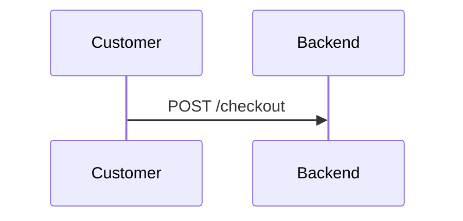

# Completeness Criteria

Binary pass/fail per criterion. 100% required for graduation.

## Component Criteria

**Applies to:** Each file in `07-curated/architecture/components/*.md`

| Criterion | Detection Rule | Failure Message |
|-----------|----------------|-----------------|
| Has overview | Heading `## Overview` exists with content below | "missing overview section" |
| Has data flow diagram | Mermaid block containing `sequenceDiagram` or `graph` | "missing data flow diagram" |
| Has edge cases | Heading `## Edge Cases` with content below | "missing edge cases section" |
| Has failure modes | Heading `## Failure Modes` with content below | "missing failure modes section" |

### Detection Logic

```
For each component file:
  1. Read file content
  2. Check for "## Overview" followed by non-empty content
  3. Check for ```mermaid block with sequenceDiagram or graph
  4. Check for "## Edge Cases" followed by non-empty content
  5. Check for "## Failure Modes" followed by non-empty content
  6. Record pass/fail for each criterion
```

### Example Pass

```markdown
## Overview
The checkout flow handles...

## Data Flow


## Edge Cases
**Reservation expires:** ...

## Failure Modes
**Firestore outage:** ...
```

### Example Fail

```markdown
## Overview
The checkout flow handles...

## Design
[Missing data flow diagram in mermaid format]

## Error Handling
[Wrong heading - should be "Failure Modes"]
```

---

## ADR Criteria

**Applies to:** Each file matching `07-curated/decisions/ADR-*.md`

| Criterion | Detection Rule | Failure Message |
|-----------|----------------|-----------------|
| Has context | Heading `## Context` or `## Problem` exists | "missing context/problem section" |
| Has decision | Heading `## Decision` exists with content | "missing decision section" |
| Has consequences | Heading `## Consequences` or `## Trade-offs` exists | "missing consequences section" |
| Has alternatives | Heading `## Alternatives` OR text containing "rejected", "considered", "alternative" | "missing alternatives considered" |

### Detection Logic

```
For each ADR file:
  1. Read file content
  2. Check for "## Context" OR "## Problem"
  3. Check for "## Decision"
  4. Check for "## Consequences" OR "## Trade-offs"
  5. Check for "## Alternatives" OR keywords in body
  6. Record pass/fail for each criterion
```

### Example Pass

```markdown
# ADR-001: Use Pessimistic Locking

## Context
We need to prevent overselling...

## Decision
Use pessimistic locking with reservations.

## Alternatives Considered
- Optimistic locking: rejected due to race conditions
- Queue-based: too complex for MVP

## Consequences
- Slightly slower checkout
- Guaranteed consistency
```

---

## Edge Case Category Criteria

**Applies to:** `07-curated/edge-cases/` folder structure

| Criterion | Detection Rule | Failure Message |
|-----------|----------------|-----------------|
| Timing cases | File `timing.md` exists OR `index.md` has "## Timing" section | "missing timing edge cases" |
| Data boundaries | File `data-boundaries.md` exists OR `index.md` has "## Data" section | "missing data boundary cases" |
| Integration cases | File `integration.md` exists OR `index.md` has "## Integration" section | "missing integration edge cases" |
| State transitions | File `state-transitions.md` exists OR `index.md` has "## State" section | "missing state transition cases" |

### Detection Logic

```
Check edge-cases/ folder:
  1. List all files in edge-cases/
  2. For each category:
     - Check if dedicated file exists
     - OR check if index.md contains section
  3. Record pass/fail for each category
```

### Valid Structures

**Option A: Separate files**
```
edge-cases/
├── timing.md
├── data-boundaries.md
├── integration.md
└── state-transitions.md
```

**Option B: Combined in index**
```
edge-cases/
└── index.md  (contains ## Timing, ## Data Boundaries, etc.)
```

**Option C: Hybrid**
```
edge-cases/
├── index.md           (overview + some sections)
├── timing.md          (dedicated file)
└── integration.md     (dedicated file)
```

---

## Required Document Criteria

**Applies to:** Specific files that must exist

| Document | Path | Detection Rule | Failure Message |
|----------|------|----------------|-----------------|
| Security threat model | `security/threat-model.md` | File exists, >100 chars | "missing security threat model" |
| Operations runbooks | `operations/runbooks.md` | File exists, >100 chars | "missing operations runbooks" |
| TDD conventions | `implementation/tdd.md` | File exists, >100 chars | "missing TDD conventions" |
| Performance targets | `performance.md` | File exists, contains markdown table | "missing performance targets with metrics" |

### Detection Logic

```
For each required document:
  1. Check if file exists at path
  2. Read file content
  3. Verify minimum content:
     - threat-model.md: non-empty (>100 chars)
     - runbooks.md: non-empty (>100 chars)
     - tdd.md: non-empty (>100 chars)
     - performance.md: contains "|" indicating table
  4. Record pass/fail
```

### Performance.md Requirements

Must contain a metrics table, e.g.:

```markdown
## Performance Targets

| Metric | Target | Priority |
|--------|--------|----------|
| API P95 latency | <200ms | Critical |
| Page load time | <2s | High |
```

---

## Scoring

### Calculation

```
Total criteria = Components×4 + ADRs×4 + EdgeCases×4 + RequiredDocs×4

Example with 4 components, 12 ADRs:
  Components: 4 × 4 = 16
  ADRs: 12 × 4 = 48
  Edge Cases: 4
  Required Docs: 4
  Total: 72 criteria

Score = (passed / total) × 100%
```

### Threshold

**100% required for graduation.**

Any single failure blocks graduation. This ensures:
- No incomplete designs reach production
- All edge cases are documented
- Security and operations are addressed
