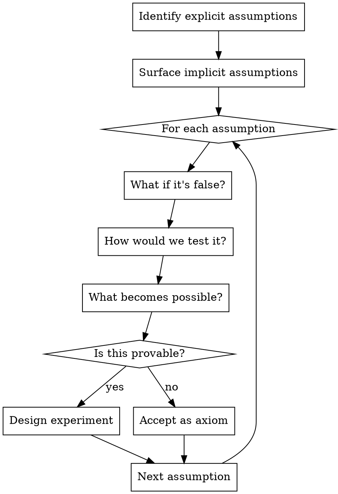

# Critique

## Overview

**Innovation requires exhaustive exploration, not satisfactory coverage.** This skill ensures you don't stop at "thorough enough" but instead explore every angle until novel insights emerge.

**Core principle:** The breakthrough is usually past the point where analysis "feels complete."

## When to Use

Use when:
- User asks to critique or refine an idea
- User wants innovation, not incremental improvement
- User says "push it to the limit" or "no stone unturned"
- User wants to ensure they've thought of everything
- Evaluating proposals, designs, or strategic decisions

**When NOT to use:**
- Quick feedback on minor details
- User explicitly wants brief/surface-level review
- Pure implementation critique (code review, not idea critique)

## The Iron Law

```
STOP WHEN YOU'VE EXHAUSTED EVERY ANGLE, NOT WHEN IT FEELS THOROUGH
```

## Red Flags - You're Rationalizing

| Thought | Reality |
|---------|---------|
| "This is thorough enough" | Thorough ≠ exhaustive. Keep going. |
| "I've covered the main points" | Innovation hides in the "minor" points. |
| "More would be redundant" | Redundancy often reveals new connections. |
| "That angle seems far-fetched" | Far-fetched angles yield novel insights. |
| "This feels complete" | Feelings lie. Use the checklist. |
| "I've given good alternatives" | Good ≠ exhaustive. What's #10? #15? |
| "That's probably not relevant" | Probably ≠ certainly. Explore it. |

**All of these mean: Keep digging.**

## Core Critique Framework

### 1. Multi-Dimensional Analysis

Don't just analyze the idea. Analyze:

| Dimension | Questions |
|-----------|-----------|
| **Problem** | Is this the right problem? Who says? What's upstream? |
| **Solution** | Why this approach? What are 10 alternatives? What's the opposite? |
| **Assumptions** | What must be true? What if it's not? Which are provable? |
| **Constraints** | Real vs imagined? What if removed? What if added? |
| **Context** | Who benefits? Who loses? What changes when this succeeds? |
| **Timing** | Why now? Too early? Too late? What's the catalyst? |
| **Scale** | 10x thinking or 10% thinking? What does 100x look like? |
| **Adjacent Possible** | What becomes possible if this works? What emerges? |

### 2. Innovation Techniques (Use All)

**Inversion**
- What if we did the opposite?
- What if the constraint is actually the solution?
- What if failure is success?

**First Principles**
- Strip to atomic truths
- Rebuild from scratch
- Challenge every inherited assumption

**Constraint Manipulation**
- Remove each constraint - what opens up?
- Add absurd constraints - what novel solutions emerge?
- What if we had infinite X? Zero Y?

**Combinatorial Thinking**
- Combine with ideas from different domains
- Cross-pollinate across industries
- What does biology/physics/art teach us here?

**Extreme Scenarios**
- Best case (everything goes right)
- Worst case (everything goes wrong)
- Weirdest case (unexpected consequences)
- What emerges in each scenario?

**Second-Order Effects**
- What happens after this succeeds?
- What new problems emerge?
- What behaviors change?
- What becomes possible that wasn't before?

### 3. Exhaustive Alternative Generation

Don't stop at 3-5 alternatives. Generate:
- 10 obvious alternatives
- 5 adjacent approaches
- 3 opposite approaches
- 2 absurd approaches (often hide insights)
- 1 "what if the whole premise is wrong" approach

### 4. Assumption Archaeology

Every idea rests on assumptions. Dig them all up:



### 5. Failure Mode Mapping

Map every way this could fail:
- Technical failures
- Market failures
- Adoption failures
- Organizational failures
- Second-order failures (success creates new problems)
- Emergent failures (unpredictable interactions)

Then: Design around each, or prove why it won't happen.

## Quick Reference: Depth Checklist

Before concluding your critique, verify:

- [ ] Challenged the problem itself (not just the solution)
- [ ] Generated 10+ alternatives (not 3-5)
- [ ] Explored opposite approaches
- [ ] Applied first principles thinking
- [ ] Removed each major constraint hypothetically
- [ ] Added absurd constraints to spark creativity
- [ ] Cross-pollinated from 3+ different domains
- [ ] Mapped second-order effects
- [ ] Identified 10+ failure modes
- [ ] Extracted all assumptions (explicit and implicit)
- [ ] Designed experiments to test key assumptions
- [ ] Explored best/worst/weirdest scenarios
- [ ] Asked "what if this succeeds beyond expectations?"
- [ ] Asked "what if the opposite were true?"
- [ ] Pushed 10x thinking (not incremental improvement)

**If any box is unchecked, you're not done.**

## Common Mistakes

| Mistake | Fix |
|---------|-----|
| Stopping at "feels thorough" | Use the depth checklist |
| Linear analysis only | Apply all innovation techniques |
| Accepting problem as stated | Challenge the problem itself |
| 3-5 alternatives | Generate 20+ |
| Ignoring far-fetched angles | Explore especially the far-fetched |
| Implicit assumptions stay hidden | Force them into the open |
| "Probably not relevant" filter | Explore anyway, find connections |

## Example: Applying the Framework

**Idea**: "Build a productivity app for remote workers"

**Baseline critique** would cover:
- Market saturation
- Differentiation challenges
- Monetization concerns
- Suggest niching down

**Exhaustive critique** continues with:

**Inversion**: What if we built an "anti-productivity" app? What if we helped people work less effectively to prevent burnout? (Insight: maybe productivity isn't the real problem - sustainability is)

**First Principles**: Why do remote workers need productivity? Because they lack office structure. Why do they lack structure? Because remote work removed social accountability. What if we rebuilt social accountability digitally? (Now we're solving a different problem)

**Constraint Removal**: What if we had infinite access to people's work patterns? We'd predict burnout before it happens. Can we approximate that with voluntary data sharing? (New product direction)

**Extreme Scenario**: What if 100% of knowledge workers went remote tomorrow? This app becomes infrastructure. How does that change our approach? (Scale thinking unlocks enterprise pivot)

**Second-Order**: If everyone uses this and gets 2x productive, what happens? Companies expect 2x output. New baseline emerges. Productivity gains get competed away. (Maybe we need to solve coordination, not individual productivity)

**Cross-Pollination**: How does biology handle distributed coordination? Ant colonies. No central planning. Pheromone trails. Can we build "pheromone trails" for remote work? (Novel metaphor unlocks new UX)

**This continues until every technique is exhausted.**

## The Bottom Line

**Natural tendency:** Stop when critique feels complete
**Innovation requirement:** Stop when you've exhausted every angle

If you're not uncomfortable with how deep you've gone, you haven't gone deep enough.

The breakthrough is always past "thorough."
