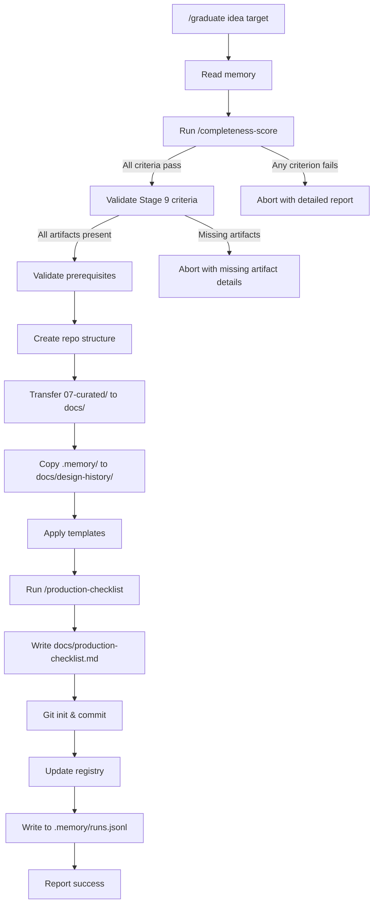

# Graduate Skill

Creates a new project repository from a curated idea with all design documentation properly organized.

## Usage

```bash
/graduate <idea-name> <target-path>
```

Example:
```bash
/graduate task-manager ~/projects/task-manager
```

## Prerequisites

- Idea must have `07-curated/` folder (run `/curating-artifacts` first)
- Idea must have `08-validated/` folder (run `/validate-design` first)
- `07-curated/dependency-risk.md` must exist
- Curation must be complete (no TBDs, all files present)
- All completeness criteria must pass (checked automatically)

## Process

### 0. Read Memory

**Reference:** See [_memory.md](./_memory.md) for memory operations.

Check if memory exists and load context:

```bash
ls ideas/<idea-name>/.memory/ 2>/dev/null
```

**If memory exists:**

1. **Read runs.jsonl** - Show refinement history:
   ```bash
   cat ideas/<idea-name>/.memory/runs.jsonl | tail -10
   ```

   Report to user:
   ```
   Reading memory...
   Refinement history:
     <date>: advance-stage <from> → <to>
     <date>: validate-design (verdict: <verdict>)
     <date>: curating-artifacts (<n> files)
   ```

2. **Read context.md** - Show accumulated context:
   ```bash
   cat ideas/<idea-name>/.memory/context.md
   ```

   Report relevant context:
   ```
   Context loaded:
     - <key preferences>
     - <key decisions>
   ```

**If no memory:** Proceed normally.

### 1. Run Completeness Check

**This step blocks graduation if any criteria fail.**

Run `/completeness-score` against the curated artifacts:

```bash
# Invoke completeness-score skill
/completeness-score <idea-name>
```

See [completeness-score/SKILL.md](./completeness-score/SKILL.md) for criteria details.

**On failure:** Abort immediately with detailed report showing what's missing.

**On success:** Continue to step 1b.

### 1b. Validate Stage 9 (Graduate) Criteria

**This step blocks graduation if required artifacts are missing.**

Check for required artifacts:

```bash
# Check 08-validated/ exists (multi-agent validation)
ls ideas/<idea-name>/08-validated/

# Check dependency-risk.md in curated folder
ls ideas/<idea-name>/07-curated/dependency-risk.md
```

**Validation rules:**

1. **`08-validated/` (required):** Multi-agent validation must be completed. If missing:
   ```
   ABORT: 08-validated/ not found.
   → Run `/validate-design <idea-name>` to complete multi-agent validation before graduating.
   ```

2. **`07-curated/dependency-risk.md` (required):** Dependency risk assessment must be in the curated package. If missing:
   ```
   ABORT: 07-curated/dependency-risk.md not found.
   → Add dependency-risk.md to 07-curated/ (see docs/dependency-risk.md for template).
   → Then re-run `/curating-artifacts <idea-name>` if needed.
   ```

**On all checks passing:** Continue to step 2.

### 2. Validate Prerequisites

```bash
# Check curated folder exists
ls ideas/<idea-name>/07-curated/

# Verify completeness
cat ideas/<idea-name>/07-curated/status.md
```

- Verify idea exists in registry
- Verify `07-curated/` folder exists and is complete
- Verify target path doesn't already exist
- Confirm with user before proceeding

### 3. Create Repository Structure

```bash
mkdir -p <target-path>/{docs,src,tests}
cd <target-path>
git init
```

### 4. Transfer Curated Artifacts

Map curated structure to new repo:

| Source (07-curated/) | Target (new repo) |
|-------------------|-------------------|
| overview.md | docs/overview.md |
| requirements.md | docs/requirements.md |
| architecture/ | docs/architecture/ |
| decisions/ | docs/decisions/ |
| edge-cases/ | docs/edge-cases/ |
| security/ | docs/security/ |
| operations/ | docs/operations/ |
| implementation/ | docs/implementation/ |
| performance.md | docs/performance.md |
| trade-offs.md | docs/trade-offs.md |

### 4b. Copy Memory (If Exists)

If `.memory/` folder exists, copy to graduated repo with renamed files:

```bash
# Check if memory exists
if [ -d "ideas/<idea-name>/.memory" ]; then
    mkdir -p <target-path>/docs/design-history
    cp ideas/<idea-name>/.memory/runs.jsonl <target-path>/docs/design-history/refinement-runs.jsonl
    cp ideas/<idea-name>/.memory/context.md <target-path>/docs/design-history/design-context.md
fi
```

| Source (.memory/) | Target (new repo) |
|-------------------|-------------------|
| runs.jsonl | docs/design-history/refinement-runs.jsonl |
| context.md | docs/design-history/design-context.md |

**Note:** Memory is copied (not moved). The original stays in ai-baseline for continued refinement.

### 5. Apply Templates

Copy from `templates/`:
- README.md (customize with project name)
- CLAUDE.md (customize with project context)
- .gitignore

### 6. Create CLAUDE.md

Generate project-specific CLAUDE.md:

```markdown
# <Project Name>

[From overview.md - one paragraph summary]

## Architecture

See `docs/architecture/overview.md` for full details.

Key components:
- [List from architecture/components/]

## Key Decisions

See `docs/decisions/` for ADRs. Key choices:
- [Top 3-5 decisions from ADR index]

## Key Conventions

- TDD conventions: `docs/implementation/tdd.md` — red-green-refactor cycle, mocking strategy, test priority. All new code must be written test-first.

## Development

[Standard sections from template]
```

### 7. Generate Production Checklist

Run `/production-checklist` to extract actionable items from curated docs:

```bash
# Invoke production-checklist skill
/production-checklist <idea-name>
```

This creates `docs/production-checklist.md` with:
- Infrastructure setup items
- Security requirements
- Integration setup
- Monitoring configuration
- Test scenarios from edge cases
- Compliance requirements

See [production-checklist/SKILL.md](./production-checklist/SKILL.md) for extraction rules.

### 8. Create Initial Commit

```bash
git add .
git commit -m "Initial commit from ai-baseline graduation

Graduated from idea: <idea-name>
Refinement completed: <date>

Co-Authored-By: Claude <noreply@anthropic.com>"
```

### 9. Update Registry

```json
{
  "graduatedAt": "<ISO date>",
  "targetPath": "<target-path>",
  "status": "graduated"
}
```

### 9b. Write Memory

**Reference:** See [_memory.md](./_memory.md) for memory operations.

1. **Create memory folder (if needed):**
   ```bash
   mkdir -p ideas/<idea-name>/.memory
   ```

2. **Append to runs.jsonl:**
   ```bash
   echo '{"skill":"graduate","ts":"<ISO-8601>","idea":"<idea-name>","result":"completed","data":{"target":"<target-path>","templates":["README.md","CLAUDE.md",".gitignore"],"memory_copied":<true|false>}}' >> ideas/<idea-name>/.memory/runs.jsonl
   ```

**Note:** Do NOT ask about writing to context.md for graduation - the idea is graduating and context has served its purpose.

Report:
```
Updating memory...
✓ Logged graduation to .memory/runs.jsonl
```

### 10. Report Success

```
Graduated: <idea-name> → <target-path>

docs/
├── overview.md
├── requirements.md
├── architecture/
│   ├── overview.md
│   ├── data-model.md
│   ├── api-contracts.md
│   └── components/
├── decisions/
├── edge-cases/
├── security/
├── operations/
├── implementation/
│   └── tdd.md
├── design-history/            ← From .memory/
│   ├── refinement-runs.jsonl
│   └── design-context.md
├── performance.md
├── trade-offs.md
└── production-checklist.md

Next steps:
1. cd <target-path>
2. Review docs/overview.md
3. Work through docs/production-checklist.md
4. Start building!
```

## Flow Diagram



## Output Structure

```
<target-path>/
├── README.md              (from template, customized)
├── CLAUDE.md              (generated from curated docs)
├── .gitignore             (from template)
├── docs/
│   ├── overview.md
│   ├── requirements.md
│   ├── architecture/
│   │   ├── overview.md
│   │   ├── data-model.md
│   │   ├── api-contracts.md
│   │   └── components/
│   │       └── *.md
│   ├── decisions/
│   │   ├── index.md
│   │   └── ADR-*.md
│   ├── edge-cases/
│   │   └── *.md
│   ├── security/
│   │   ├── threat-model.md
│   │   └── compliance/
│   ├── operations/
│   │   └── *.md
│   ├── implementation/
│   │   └── tdd.md
│   ├── design-history/        ← Copied from .memory/
│   │   ├── refinement-runs.jsonl
│   │   └── design-context.md
│   ├── performance.md
│   ├── trade-offs.md
│   └── production-checklist.md   ← Generated checklist
├── src/                   (empty, ready for code)
└── tests/                 (empty, ready for tests)
```

## Error Handling

| Error | Resolution |
|-------|------------|
| Completeness check fails | Fix issues listed in report, retry |
| No 07-curated/ folder | Run `/curating-artifacts <idea-name>` first |
| No 08-validated/ folder | Run `/validate-design <idea-name>` first |
| Missing dependency-risk.md | Add to 07-curated/ using `docs/dependency-risk.md` template |
| Incomplete curation | Check `07-curated/status.md`, complete missing items |
| Target path exists | Choose different path or remove existing |
| Idea not in registry | Check idea name, run `/list-ideas` |

## Customization

Ask user:

```
Project type?
1. Web application (frontend + backend)
2. Library/Package
3. CLI tool
4. API service

Primary language?
1. TypeScript
2. Python
3. Ruby
4. Go
5. Other
```

Adjust folder structure and templates based on answers.
