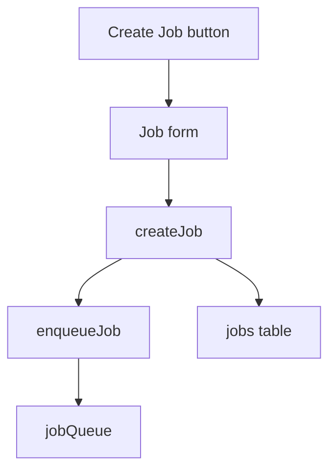

# System Design Breadboarding

Breadboarding transforms a workflow description into a complete map of affordances and their relationships. The output is always a set of tables showing numbered UI and code affordances with their Wires Out and Returns To relationships. The tables are the truth. Mermaid diagrams are optional visualizations for humans.

Use this to understand how a system works, design a new system from shaped parts, or communicate system structure to builders.

## When to Use

- You need to understand how an existing system works in concrete detail
- You have a new system sketched as an assembly of parts from shaping and need to detail the concrete mechanism
- You need to show how existing and new pieces interact as a system
- You want to slice a design into vertical, end-to-end implementation chunks
- The system spans multiple applications (frontend + backend + services)

## When Not to Use

- The problem is a simple UI tweak with no system-level changes
- The architecture is already documented and well-understood
- The user wants to jump straight to code without any design mapping

## Use Cases

### 1. Mapping an Existing System

You don't understand how an existing system works in its concrete details. You have a workflow you're trying to understand — explaining how something happens or why something doesn't happen.

**Input:**
- Code repo(s) to analyze
- Workflow description (always from the perspective of an operator trying to make an effect happen — through UI or as a caller)

**Output:**
- Places list
- UI Affordances table
- Code Affordances table
- Data Stores table
- Wiring relationships (Wires Out / Returns To)
- (Optional) Mermaid visualization

If the workflow spans multiple applications (frontend + backend), create **one breadboard** that tells the full story. Label places to show which system they belong to.

### 2. Designing from Shaped Parts

You have a new system sketched as an assembly of parts (mechanisms) from shaping. You need to detail out the concrete mechanism and show how those parts interact as a system.

**Input:**
- Parts list (mechanisms from shaping)
- The R (requirement/outcome) the parts are meant to achieve
- Existing system (optional) — if the new parts must interoperate with existing code

**Output:**
- Same tables as above

### 3. Mixed Systems

Often you have both: an existing system that must remain as-is, plus new pieces or changes defined in a shape. Breadboard both together — the existing affordances and the new ones — showing how they connect.

## Core Concepts

### Places

A Place is a **bounded context of interaction**. While you're in a Place:

- You have a specific set of affordances available to you
- You **cannot** interact with affordances outside that boundary
- You must take an action (click, submit, navigate) to move to another Place

Think of Places as screens, modals, or distinct operational contexts. Each Place has a name and contains affordances that belong to it.

### Affordances

An affordance is something the system offers that a user or caller can do.

**UI Affordances:** What the user sees and can interact with.
- Buttons, links, form fields, toggles, tabs, dropdowns
- Named by the action they enable (not the implementation)

**Code Affordances:** What the system does behind the scenes.
- Functions, API endpoints, background jobs, event handlers
- Named by what they accomplish at the step level

### Wiring

Wiring shows how affordances connect:

- **Wires Out:** What an affordance triggers or calls next (solid arrows)
- **Returns To:** What data or control flows back (dashed arrows)

Every affordance should have its wiring explicitly shown in the tables.

### Data Stores

Any module-level constant, configuration, template, database table, or cache that an affordance reads to produce effects is a Data Store. Even static values count.

Ask: *"What does this affordance need to know in order to do its job?"* If the answer references something not in the breadboard, it's missing.

## Output Format

### 1. Places

```markdown
## Places

| # | Name | System | Description |
|---|------|--------|-------------|
| P1 | Dashboard | Web App | Main landing after login |
| P2 | Settings Modal | Web App | Overlay for configuration |
| P3 | API Gateway | Backend | Request routing layer |
```

### 2. UI Affordances Table

```markdown
## UI Affordances

| # | Name | Place | Description | Wires Out | Returns To |
|---|------|-------|-------------|-----------|------------|
| U1 | Create Job button | P1 Dashboard | Opens job creation flow | U2, C1 | — |
| U2 | Job form | P1 Dashboard | Input fields for new job | C2 | C2 (validation) |
```

### 3. Code Affordances Table

```markdown
## Code Affordances

| # | Name | Place | Description | Wires Out | Returns To |
|---|------|-------|-------------|-----------|------------|
| C1 | validateJobInput | P1 Dashboard | Checks form fields | — | U2 (errors) |
| C2 | createJob | P3 API Gateway | Persists job to DB | C3 | U1 (success) |
| C3 | enqueueJob | P3 API Gateway | Sends to worker queue | — | — |
```

### 4. Data Stores Table

```markdown
## Data Stores

| # | Name | Type | Read By | Written By |
|---|------|------|---------|------------|
| D1 | jobs table | PostgreSQL | C4, C5 | C2 |
| D2 | jobQueue | Redis | C3 | C2 |
| D3 | config.yaml | File | C1 | — |
```

### 5. Mermaid Diagram (Optional)

```markdown
## Wiring Diagram


```

## Naming Conventions

- **UI affordances:** verb + noun (what action + what object) — "Create Job button", "Filter by status dropdown"
- **Code affordances:** verb + noun at step level — "validateJobInput", "enqueueJob", "notifyUser"
- **Places:** noun phrase describing the context — "Dashboard", "Settings Modal", "Payment Flow"
- **Data stores:** noun describing the data — "jobs table", "userCache", "emailTemplates"

Avoid implementation-heavy names ("handleClick", "onSubmit", "processData"). Name by what the step accomplishes, not the event or generic action.

## Whiteboard Conventions

When drawing breadboards by hand or on a whiteboard:

| Element | How it appears |
|---------|----------------|
| **Place** | Colored block (often pink/purple) at the **top** of a vertical stack |
| **Affordances in a place** | Blocks stacked **underneath** the place block |
| **Code affordances** | Float **between** place stacks, not inside them |
| **Place loader** | Code affordance at **top-left** of a place block — describes data needed to render |
| **Wires Out** | Solid arrows between blocks |
| **Returns To** | Dashed arrows between blocks |
| **Conditionals** | Indented blocks within a stack, different color, showing if/else branches |
| **Place references** | `_` prefix on a place name within a stack (e.g., `_Dashboard`) |
| **Uncertain/tentative** | `?` prefix or `~` prefix on an affordance name, or dashed borders |
| **Containing box** | Large boundary around multiple stacks — groups by system or responsibility |

### Translating Whiteboard to Tables

1. Identify places (colored header blocks at the top of each stack)
2. Read each stack top-to-bottom — everything under a place belongs to it
3. Find loaders — code affordances at the top-left describe rendering data
4. Trace wiring — solid arrows for control flow, dashed for data flow
5. Check conditionals — indented colored blocks show branching
6. Capture everything in the standard tables

## Working with Multiple Systems

When the workflow spans frontend + backend + external services:

- Use **one breadboard** for the full story
- Label each Place with its system (see Places table)
- Use a containing box in Mermaid or label prefixes to keep boundaries clear
- Make the wiring explicit across system boundaries

## Slicing with Breadboards

Breadboards help identify **vertical slices** for implementation:

1. Trace a user story through the wiring from start to finish
2. The affordances and stores touched along that path form a slice
3. Look for natural seams where the path can be cut into independently shippable chunks
4. Each slice should deliver end-to-end value — not just a layer

Example slices from a breadboard:
- S1: Create job end-to-end (UI form → API → DB → queue confirmation)
- S2: Job status tracking end-to-end (status UI → polling → display)
- S3: Job retry controls end-to-end (retry button → API → queue → notification)

## Common Pitfalls

1. **Letting Mermaid become the source of truth.** The tables are the canonical representation. Mermaid is for human reading only. If the tables and diagram disagree, the tables win.

2. **Mixing UI and code affordances in one table.** Keep them separate. UI affordances live in Places; code affordances may span Places or float between them.

3. **Forgetting Data Stores.** Module-level constants, configs, and templates are easy to miss because they don't change at runtime. If code reads it to produce effects, it's a store.

4. **Naming affordances by implementation.** "handleClick" describes the event, not what the step does. "Create Job" or "Submit Application" is the right level.

5. **Creating multiple breadboards for one workflow.** One workflow = one breadboard. If the system spans frontend and backend, show both in the same diagram. Splitting breaks the wiring story.

6. **Skipping the wiring.** An affordance without Wires Out or Returns To is an island. Every affordance should show what it triggers and what flows back.

7. **Breadboarding without a workflow to map.** Breadboarding requires a specific workflow ("user creates a job", "admin reviews flagged content"). Don't try to map a whole codebase abstractly — pick a concrete flow.

## Quick-Start Recipe

### Scenario: mapping an existing authentication flow

```
1. Identify the workflow: "User signs in, gets redirected, and lands on dashboard"

2. List Places:
   - P1: Login Page
   - P2: OAuth Provider (external)
   - P3: Callback Handler
   - P4: Dashboard

3. List UI Affordances:
   - U1: Email input (P1)
   - U2: Password input (P1)
   - U3: Sign In button (P1)
   - U4: "Sign in with Google" link (P1)

4. List Code Affordances:
   - C1: authenticateLocal (P1)
   - C2: redirectToOAuth (P1)
   - C3: handleOAuthCallback (P3)
   - C4: createSession (P3)
   - C5: fetchUserProfile (P4)

5. Map wiring:
   - U3 → C1 → (success) → C4 → P4
   - U4 → C2 → P2 → C3 → C4 → P4
   - C5 → D1[user table] → P4

6. List Data Stores:
   - D1: user table
   - D2: session store

7. (Optional) Render Mermaid
```

## Verification Checklist

- [ ] One breadboard per workflow (not per system or layer)
- [ ] All Places are named and described
- [ ] UI Affordances and Code Affordances are in separate tables
- [ ] Every affordance has Wires Out and/or Returns To explicitly listed
- [ ] Affordance names describe what the step accomplishes, not the event
- [ ] All data stores that code reads are captured in the Data Stores table
- [ ] Wiring traced across system boundaries if workflow spans multiple apps
- [ ] Mermaid diagram (if present) is consistent with the tables
- [ ] Slices can be identified by tracing user stories through the wiring
